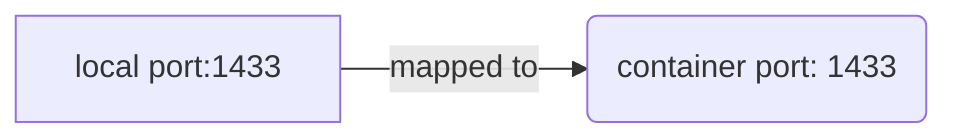

#### Software/Tool Requirements

##### .NET 8.* SDK
Download [DOTNET SDK 8.0](https://dotnet.microsoft.com/en-us/download/dotnet/8.0)

##### Docker & Containerization
Download [Docker Desktop On Windows](https://docs.docker.com/desktop/install/windows-install/), only if you are trying to use containers.

After installation, run this on a console: 
```
docker run -d --name sql_server -e 'ACCEPT_EULA=Y' -e 'SA_PASSWORD=someThingComplicated1234' -p 1433:1433 mcr.microsoft.com/mssql/server:2019-latest
```

`-d` will launch the container in "detached" mode and is optional. This means that containers will run in the background and you can close the terminal window.

`--name` ***sql_server*** will assign a name to the container and is optional, but recommended for easier management!

`-e` will allow you to set environment variables: `ACCEPT_EULA=Y` SQL Server requires the user to accept the "End User Licence Agreement" or EULA. The Y here indicates acceptance.

`SA_PASSWORD=someThingComplicated1234` is a required parameter for SQL Server. This is the System Administrator (`sa`) password.
See the note below on password strength.

`-p 1433:1433` will map the local port 1433 to port 1433 on the container. Port 1433 is the default TCP port that SQL Server will listen on.


`mcr.microsoft.com/mssql/server:2019-latest` is the image we wish to run. I have used (not) the latest version of 2019, however, if you need a different version you can check out the Microsoft SQL Server page on Docker Hub.

##### .NET Cli
Read up on this: https://learn.microsoft.com/en-us/ef/core/managing-schemas/migrations/?tabs=dotnet-core-cli

#### Configuration

appsettings.json
```
{
  "ConnectionStrings": {
    "DefaultConnection": "Server=localhost;Database=<database>;User Id=sa;Password=<Password>;TrustServerCertificate=True;MultiSubnetFailover=True;",    
  },
  "Logging": {
    "LogLevel": {
      "Default": "Information",
      "Microsoft.AspNetCore": "Warning"
    }
  },
  "AllowedHosts": "*"
}
```

#### Forking the repository


